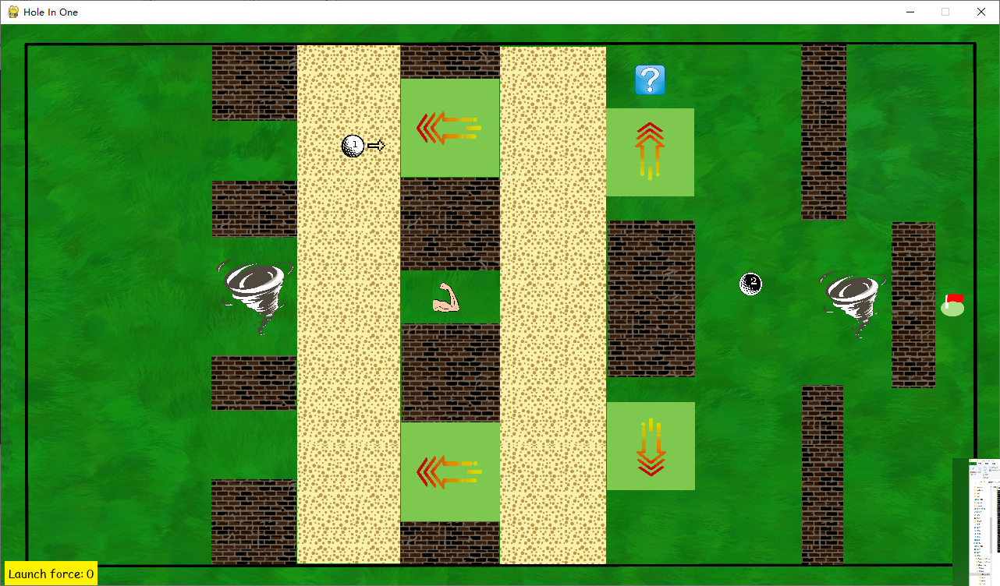
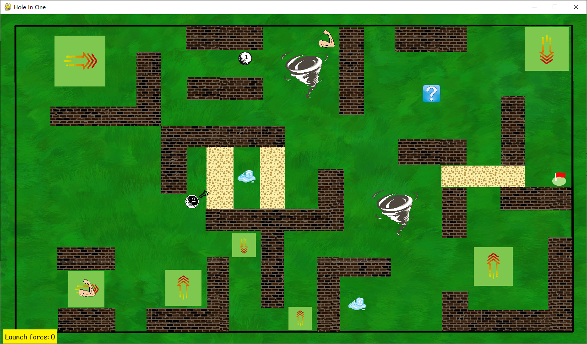

# Hole-in-one
Golf simulatior game project for CS269

Hole-in-one is a two-player golf simulator game. In this game, you can:

-- Take turns to launch your ball across grass, sand, acceleration pads and tornados

-- Collect powerful effects that change the balance to your favor

-- Defeat your opponent by being the first to score a goal across multiple exciting levels

### Credits:

**Producer:** Xinlai "Peter" Li

**Design:** Yiheng Su

**Lead Developper:** Blitzen Wang

**Artwork:** Ashley Ren

**Interface:** Chloe Zhang and Yiheng Su

**Sountrack:** Miaoyi "Scottie" Yang

**Lead QA:** Xinlai "Peter" Li

**Programming:** Blitzen Wang, Yiheng Su, Chloe Zhang
